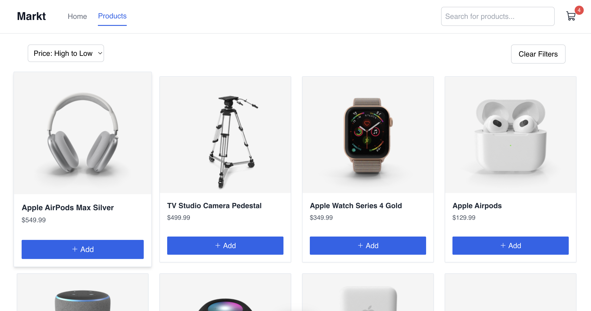

# Alpine Markt

Alpine Markt is a simple e-commerce website that allows users to add products to a shopping cart and calculate the total price of the products. The shopping cart data is stored in the local storage, so the data persists even after the page is refreshed.

**Demo: [alpine-markt.vercel.app](https://alpine-markt.vercel.app)**

[](https://alpine-markt.vercel.app)


## Features

- **API Integration**: The application uses the [DummyJSON API](https://dummyjson.com/) to fetch product data.
- **Add Products**: Add products to the shopping cart.
- **Remove Products**: Remove products from the shopping cart.
- **Clear Cart**: Clear the shopping cart and remove all products.
- **Calculate Total**: Calculate the total price of the products in the shopping cart.
- **Local Storage**: The shopping cart data is stored in the local storage.
- **Responsive Design**: The application is responsive and works on all devices.

## Tech Stack


- **Framework**: [Alpine.js](https://alpinejs.dev)
- **Styling**: [Tailwind CSS](https://tailwindcss.com)
- **API**: [DummyJSON](https://dummyjson.com)
- **Build Tool**: [Vite](https://vite.dev)
- **Deployment**: [Vercel](https://vercel.com)

## Getting Started

To get started with this project, follow these steps:

1. **Clone the repository**:

   ```sh
   git clone https://github.com/zorkham/alpine-markt.git
   ```

2. **Install dependencies**:

   ```sh
   pnpm install
   ```

3. **Run project locally**:

   ```sh
   pnpm dev
   ```

4. **Open your browser**: Go to `http://localhost:3000` to see the app in action.

## Other Projects

- [Alpine Password Manager](https://github.com/Zorkham/alpine-password-manager)
- [Alpine Board Game Explorer](https://github.com/Zorkham/alpine-board-game-explorer)
- [Alpine Pokedex](https://github.com/Zorkham/alpine-pokedex)
